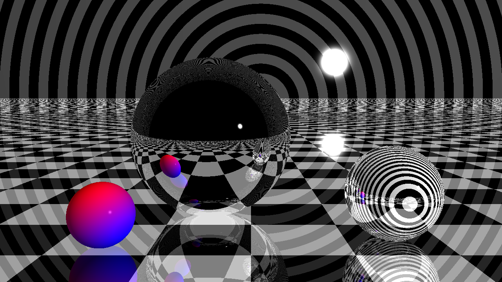
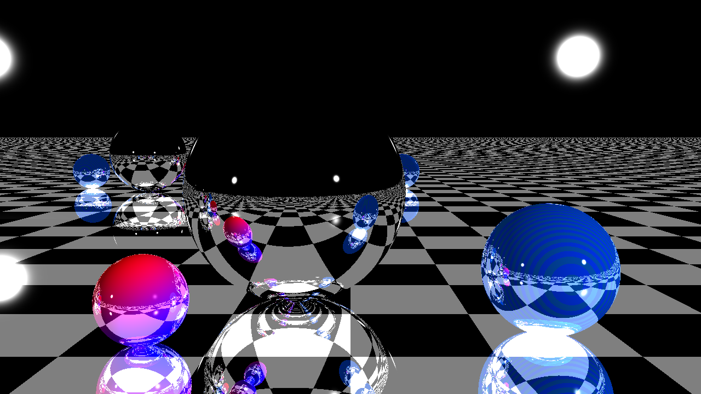

# About 
 - An basic implementation in rust of The Ray Tracer Challange Book.
 - Chapters implemented: 1 - 12.
 - To improve the ray tracing algorithm, rayon was used, parallelizing it for better performance
 - An suggestion will be apreciate.

# Examples 
- `Run: cargo run -r --example example_1`
- 

- `Run: cargo run -r --example example_2`
- 

